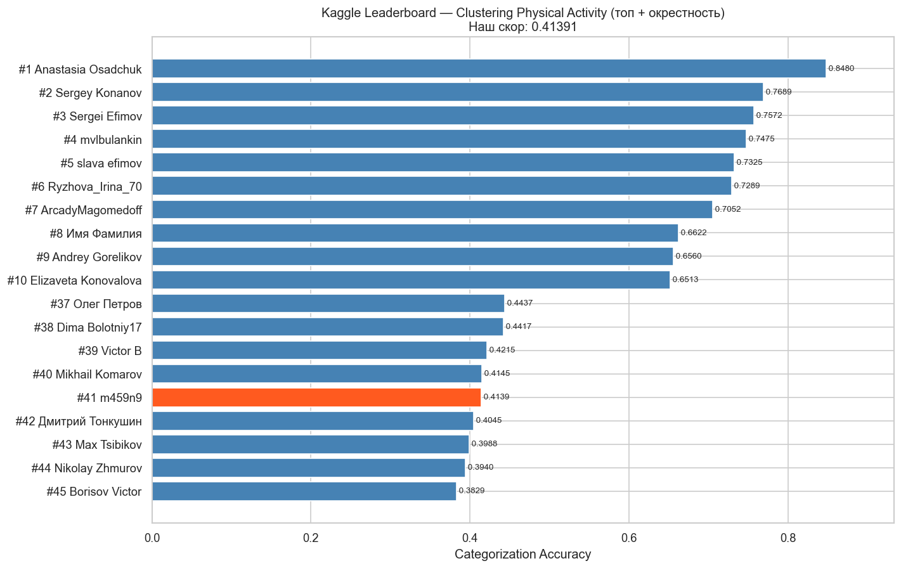

# Кластеризация физической активности

Решение Kaggle-соревнования [Clustering Physical Activity](https://www.kaggle.com/competitions/clustering-physical-activity) на датасете PAMAP2 (8 субъектов, 3 IMU, 534к точек, 12 классов активности).

Финальный пайплайн: магнитуды + rolling-фичи, per-subject z-norm, PCA 95%, KMeans K=12 на полной выборке, temporal smoothing (window=100), intensity-ordered mapping кластер→activity_id.

## Структура

```
.
├── clustering_physical_activity.ipynb   # основной ноутбук (запускается end-to-end)
├── submission.csv                       # последний сабмит
├── leaderboard.png                      # скриншот лидерборда с подсветкой нашей позиции
└── data/clustering-physical-activity/   # данные (подтягиваются через Kaggle API, если есть KGAT-токен)
```

## Запуск

```bash
pip install numpy pandas scikit-learn matplotlib seaborn jupyter nbconvert kaggle

# токен: kaggle.com → Settings → Create New API Token (формат KGAT_…)
mkdir -p ~/.kaggle && echo KGAT_... > ~/.kaggle/access_token && chmod 600 ~/.kaggle/access_token

jupyter nbconvert --to notebook --execute clustering_physical_activity.ipynb --inplace
```

## Лидерборд


